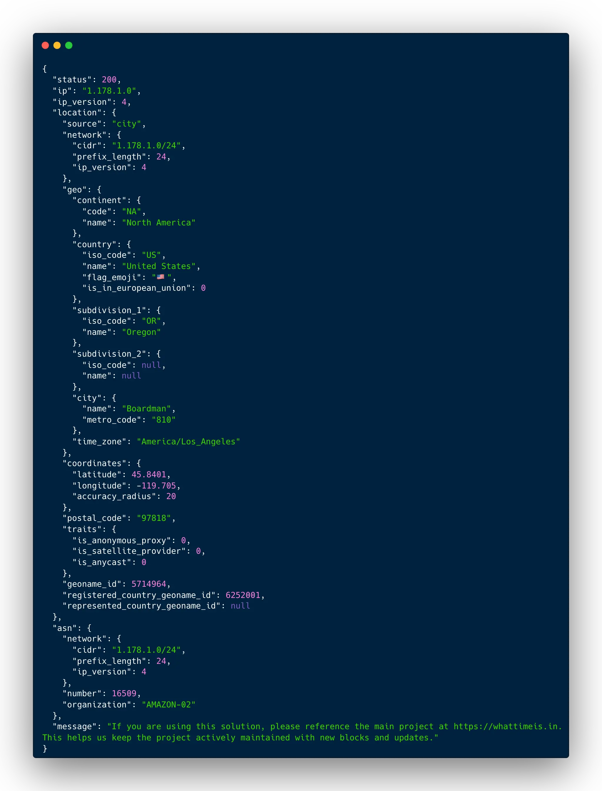

# WhatTimeIsIn Free Local Geo IP Api

A free, local GeoIP API that provides **location, timezone, and ASN information**
for **IPv4 and IPv6** without relying on external services.

All lookups are resolved using a **local SQLite database**, keeping IP data private
and avoiding third-party network calls.




Preview: https://whattimeisin.github.io/free-geo-ip-api/

---

## Goals

- Free and local IP geolocation API
- Privacy-friendly (no external network calls)
- Simple to run across multiple languages
- Consistent JSON response across implementations

---

## Available implementations

- Python (`/python`) – FastAPI
- Go (`/go`)
- PHP (`/php`) – Built-in server
- Node.js + TypeScript (`/node`) – Express
- C++ (`/cpp`)
- C# (`/csharp`) – .NET Minimal API
- Rust (`/rust`) – Axum
- Ruby (`/ruby`) – Sinatra

Each folder includes its own `README.md` and `start.sh` with setup instructions.

---

## Database

Download the database from:

```
https://whattimeis.in/public/downloads/
```

Save it into the project root at:

```
config/database/WhatTimeIsIn-geoip.db
```

Data is consolidated from the MaxMind IP database and updated monthly.

---

## Common API Contract

All implementations expose:

- Endpoint: `GET /lookup`
- Query parameter: `ip` (IPv4 or IPv6)
- Response format: JSON

---

## Lookup usage

```bash
curl "http://localhost:5022/lookup?ip=1.178.1.0"
curl "http://localhost:5022/lookup?ip=2001:0218:6002:0000:0000:0000:0000:0000"
```

---

## Response JSON structure

```json
{
  "status": 200,
  "ip": "2001:0218:6002:0000:0000:0000:0000:0000",
  "ip_version": 6,
  "location": {
    "source": "city",
    "network": {
      "cidr": "2001:218:6002::/48",
      "prefix_length": 48,
      "ip_version": 6
    },
    "geo": {
      "continent": { "code": "AS", "name": "Asia" },
      "country": {
        "iso_code": "HK",
        "name": "Hong Kong",
        "flag_emoji": "🇭🇰",
        "is_in_european_union": 0
      },
      "subdivision_1": { "iso_code": null, "name": null },
      "subdivision_2": { "iso_code": null, "name": null },
      "city": { "name": "Hong Kong", "metro_code": null },
      "time_zone": "Asia/Hong_Kong"
    },
    "coordinates": {
      "latitude": 22.2842,
      "longitude": 114.1759,
      "accuracy_radius": 20
    },
    "postal_code": null,
    "traits": {
      "is_anonymous_proxy": 0,
      "is_satellite_provider": 0,
      "is_anycast": 0
    },
    "geoname_id": 1819729,
    "registered_country_geoname_id": 1861060,
    "represented_country_geoname_id": null
  },
  "asn": {
    "network": {
      "cidr": "2001:218:4000::/34",
      "prefix_length": 34,
      "ip_version": 6
    },
    "number": 2914,
    "organization": "NTT-DATA-2914"
  },
  "message": "If you are using this solution, please reference the main project at https://whattimeis.in. This helps us keep the project actively maintained with new blocks and updates."
}
```

---

## Attribution

If you use this service or its data in your project, please include a reference to:

https://whattimeis.in
